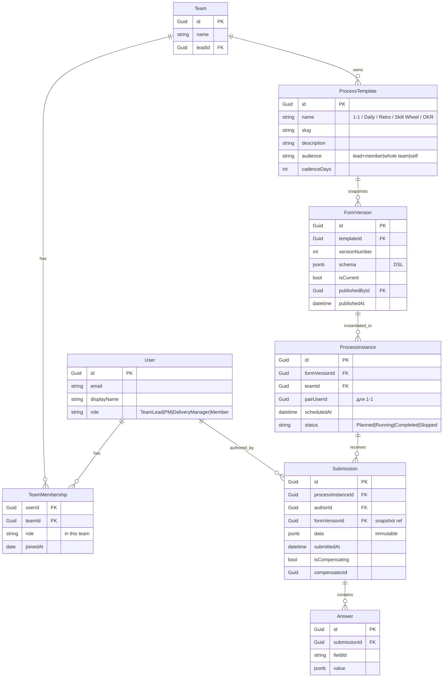

# DreamTeam Form Engine: системный дизайн ядра

## Архитектурное резюме

DreamTeam — это **form engine как runtime-среда**, а не набор отдельных фич под 1-1, daily, retro, skill wheel. Ядро системы описывает формы как данные, валидирует схемы и рендерит их через единый field-registry. 1-1, Daily, Retro, Skill Wheel, OKR Check-in становятся **preset-формами**, которые лид копирует и настраивает под себя, а не отдельными страницами, которые разработчик пишет месяцами.

Стек фиксируется так: **.NET 10 (LTS, поддержка до 14 ноября 2028)** для backend с Minimal APIs, EF Core 10 и PostgreSQL JSONB; **Nuxt 4** (стабильный с 16 июля 2025; Nuxt 3 EOL 31 июля 2026) для frontend на Vue 3, VeeValidate + Zod и shadcn-vue на Reka UI. Этот выбор даёт LTS-поддержку на 3 года вперёд и зрелые schema-driven паттерны с обеих сторон (EF Core 10 Complex Types для JSONB; Nuxt Content Studio уже доказывает, что zod → JSON Schema → form-renderer работает на Vue 3 в продакшене) [1][2][3][4].

Ключевые решения, которые защищают ядро от деградации:
- **Snapshot-on-publish**: при публикации формы фиксируется её версия; все ссылки на форму указывают на конкретный снапшот, что делает возможной эволюцию без поломки старых ответов [5].
- **Append-only submissions**: ответы никогда не обновляются и не удаляются; исправления — это новые строки или компенсирующие события, что согласуется с event-sourcing-lite подходом Microsoft [6].
- **Field registry как расширение**: новые типы полей (Skill Wheel slider, 360° peer review, Eisenhower matrix) добавляются регистрацией Vue-компонента + серверного валидатора, без форка движка.
- **Свой DSL, валидируемый Zod**: form schema — не JSON Schema Draft-07 (у неё слабая поддержка conditional logic и UI-метаданных), а компактный JSON-DSL, проверенный Zod-схемой, разделяемой между builder'ом и renderer'ом.
- **Postgres JSONB + GIN** для ответов: формы хранятся как `jsonb`, индексируются через `jsonb_path_ops` для `@>`-запросов; этого хватает для аналитики и дашбордов, без перехода на EAV [7][8].

Минимально жизнеспособный движок — это form CRUD, один preset (1-1), ссылка-приглашение и read-only dashboard. На это уходит 1-2 спринта; всё остальное растёт поверх.

## 1. Доменная модель

Доменная модель — пять сущностей вокруг формы и три глобальные, которые держат людей и команды вместе.



`FormVersion` отделён от `ProcessTemplate`, потому что шаблон — это семантическая обёртка (1-1), а версия формы — это конкретный JSON, на котором она реализована. `ProcessInstance` всегда ссылается на конкретную `FormVersion`, а не на «последнюю». Это даёт и аудит, и эволюцию: обновили шаблон 1-1, старые встречи остаются на старой версии.

`Submission.data` хранится как `jsonb` и append-only. `Answer` — альтернативная нормализованная проекция для запросов «все ответы по полю X у сотрудника Y» через GIN-индекс. На практике для MVP хватает `Submission.data` + GIN; `Answer` появляется только если запросы начинают сканировать слишком много строк.

`TeamMembership` — отдельная сущность, а не `team_id` в `User`, потому что PM ведёт 3-5 команд, а Delivery Manager — 10-15. `User.role` — глобальная роль; `TeamMembership.role` — роль в конкретной команде.

## 2. Form DSL

Form DSL — компактный JSON, описывающий страницу, поля, валидацию и conditional logic. Цель DSL — быть достаточно выразительным для Skill Wheel (где есть матрица компетенций 4×5) и одновременно тривиально сериализуемым в Zod-схему для runtime-валидации.

```json
{
  "id": "form_v_3a4f",
  "title": "Weekly 1-1",
  "version": 7,
  "pages": [
    {
      "id": "p1",
      "title": "Check-in",
      "elements": [
        { "id": "energy", "type": "rating", "label": "Energy this week", "scale": 5 },
        { "id": "mood", "type": "longtext", "label": "How are you, really?" },
        { "id": "blockers", "type": "longtext", "label": "What's slowing you down?" },
        { "id": "focus", "type": "longtext", "label": "What's your focus this week?" }
      ]
    },
    {
      "id": "p2",
      "title": "Growth",
      "elements": [
        { "id": "skill_areas", "type": "skill_wheel", "label": "Self-assessment",
          "categories": ["Technical depth", "Product thinking", "Collaboration", "Delivery"],
          "scale": 5
        },
        { "id": "career", "type": "longtext", "label": "Where do you want to be in 12 months?" },
        { "id": "manager_support", "type": "longtext", "label": "How can I help this week?",
          "visibleIf": "data.energy < 3" }
      ]
    }
  ],
  "actions": [
    { "id": "save_draft", "trigger": "manual" },
    { "id": "submit", "trigger": "manual", "validates": true }
  ]
}
```

**Поле: что покрываем.** Референс — SurveyJS (commercial MIT) и Form.io (open-core): text, longtext, number, date, datetime, select, multiselect, radio, checkbox, file, signature, rating, likert, matrix, repeater, panel/section, ranking, computed [9][10][11]. Для DreamTeam на MVP-1 — 12 базовых типов: text, longtext, number, date, select, multiselect, radio, checkbox, rating, likert, file, longtext-richtext. Skill Wheel, 360° peer review и Eisenhower matrix приходят через field-registry (см. §5), а не как core-типы.

**Валидация.** В DSL — required, min/max, regex, options (для select), custom error message. Conditional logic — через JSON-выражения в духе `data.energy < 3` (видно поле, только если energy низкий). Полноценный expression language (SurveyJS-стиль с `{q1} + {q2}`) — в v2; для MVP хватает showIf/requiredIf с простыми операторами [9].

**Computed fields** (например, автоматический «overall score» по Skill Wheel) — через `compute` со ссылкой на JS-функцию, зарегистрированную в `runtime/registry/computed.ts`. На бэкенде та же функция пересчитывается на сервере перед записью, чтобы клиент не мог подменить результат.

**Версионирование.** DSL — это снимок формы. У формы есть `version`, инкрементируется при publish. Один и тот же `ProcessTemplate` ссылается на цепочку `FormVersion`-ов, и каждая `ProcessInstance` хранит свой `formVersionId`. Это решает проблему «форму переделали, старые встречи сломались».

## 3. Storage layer

### PostgreSQL + EF Core 10 Complex Types

Стек хранения: **PostgreSQL 16**, **EF Core 10** с Complex Types для JSONB-маппинга, миграции через `dotnet ef migrations`.

EF Core 10 (вышел вместе с .NET 10 в ноябре 2025) делает JSONB маппинг через Complex Types — это рекомендованный путь, заменяющий owned-entities [1][12][13]:

```csharp
public class FormVersion
{
    public Guid Id { get; set; }
    public Guid TemplateId { get; set; }
    public int VersionNumber { get; set; }
    public FormSchema Schema { get; set; }  // mapped to jsonb
    public DateTime PublishedAt { get; set; }
}

public class FormSchema  // Complex Type
{
    public string Title { get; set; }
    public List<FormPage> Pages { get; set; }
    public List<FormAction> Actions { get; set; }
}

modelBuilder.Entity<FormVersion>(b =>
{
    b.ComplexProperty(v => v.Schema, s => s.ToJson());  // → jsonb column
});
```

Сгенерированная таблица:

```sql
CREATE TABLE "FormVersions" (
  "Id" uuid PRIMARY KEY,
  "TemplateId" uuid NOT NULL,
  "VersionNumber" int NOT NULL,
  "Schema" jsonb NOT NULL,
  "PublishedAt" timestamptz NOT NULL
);
```

EF Core 10 прозрачно транслирует LINQ в JSONB-операторы: `Where(v => v.Schema.Title == "1-1")` становится `WHERE "Schema"->>'Title' = '1-1'` [12].

### Submissions: append-only + GIN

`Submissions.Data` — тоже `jsonb`, immutable. EF Core 10 поддерживает `ExecuteUpdate` для частичных обновлений JSON, но в нашем случае обновлений не будет вообще — это контракт [1][12].

Индексация для типовых аналитических запросов:

```sql
-- 1. GIN с jsonb_path_ops для containment-запросов (90% кейсов)
CREATE INDEX idx_submissions_data_gin
  ON submissions USING GIN (data jsonb_path_ops);

-- 2. Expression B-tree для частых запросов по конкретному ключу
CREATE INDEX idx_submissions_template
  ON submissions ((data->>'templateId'));

-- 3. Partial index по process_instance, если шаблонов много
CREATE INDEX idx_submissions_pending
  ON submissions (process_instance_id)
  WHERE status = 'pending';
```

Почему `jsonb_path_ops` а не дефолтный `jsonb_ops` — это частный случай, который подтверждён бенчмарками: индекс в среднем на 37% меньше, запросы на `@>` на 20-25% быстрее, write-overhead ниже [7][8]. Дефолтный `jsonb_ops` нужен только если реально используются операторы `?`, `?|`, `?&` (key-existence), что для submissions — редкость.

### Attachments

MVP — MinIO (S3-compatible) для файлов. `Submissions.Data` хранит только URL+метаданные (`{ "fileId": "...", "url": "presigned...", "size": 1024, "mime": "image/png" }`). Реальный blob никогда не попадает в Postgres, что убирает риск раздувания БД.

### Audit log

Минимальный audit — `form_versions` уже хранит `published_by_id` + `published_at`. Для v2 — отдельный `audit_events` append-only с fan-out: кто создал шаблон, кто опубликовал версию, кто отправил submission, кто компенсировал (отозвал/исправил) submission. Pattern — event-sourcing-lite как у Microsoft, не полный event store [6].

## 4. Backend: .NET 10 Minimal APIs

### Структура проекта

Монорепо NuGet solution, не npm-workspaces (для .NET это роднее):

```
DreamTeam.sln
src/
  DreamTeam.Api/                # Minimal APIs host
    Program.cs                  # composition root
    Endpoints/
      FormsEndpoints.cs         # /api/v1/forms
      ProcessEndpoints.cs       # /api/v1/processes
      SubmissionsEndpoints.cs   # /api/v1/submissions
      AuthEndpoints.cs          # /api/v1/auth
    Infrastructure/
      JwtAuthFilter.cs          # endpoint filter
      ValidationFilter.cs       # + AddValidation
      ProblemDetailsExtensions.cs
  DreamTeam.Domain/             # entities, value objects
  DreamTeam.Infrastructure/     # DbContext, repositories
  DreamTeam.Contracts/          # DTOs, request/response models
tests/
  DreamTeam.Api.Tests/          # WebApplicationFactory + Testcontainers
```

### Endpoint filters + validation

В .NET 10 появилась встроенная валидация Minimal APIs: `AddValidation()` + DataAnnotations на DTO [14][15]. Для более сложных правил (cross-field, conditional) подключаем FluentValidation как endpoint filter.

```csharp
// Program.cs
builder.Services.AddValidation();        // built-in DataAnnotations
builder.Services.AddScoped<IValidator<CreateFormRequest>, CreateFormValidator>();

var app = builder.Build();

app.MapFormsEndpoints();
app.MapProcessEndpoints();
app.MapSubmissionsEndpoints();
app.MapAuthEndpoints();
```

```csharp
// Endpoints/FormsEndpoints.cs
public static class FormsEndpoints
{
    public static void MapFormsEndpoints(this IEndpointRouteBuilder app)
    {
        var group = app.MapGroup("/api/v1/forms")
            .RequireAuthorization("FormAccess")
            .WithTags("Forms")
            .AddEndpointFilter<ValidationFilter>();

        group.MapGet("/", async (AppDbContext db) =>
            TypedResults.Ok(await db.FormVersions
                .Select(v => new FormVersionDto(v.Id, v.TemplateId, v.VersionNumber, v.PublishedAt))
                .ToListAsync()));

        group.MapPost("/", async (
            CreateFormRequest req,
            AppDbContext db,
            ICurrentUser user) =>
        {
            var template = new ProcessTemplate
            {
                Name = req.Name,
                Slug = req.Slug,
                Description = req.Description,
                CadenceDays = req.CadenceDays
            };
            var v1 = new FormVersion
            {
                TemplateId = template.Id,
                VersionNumber = 1,
                Schema = req.Schema,        // FormSchema Complex Type → jsonb
                PublishedById = user.Id,
                PublishedAt = DateTime.UtcNow
            };
            db.ProcessTemplates.Add(template);
            db.FormVersions.Add(v1);
            await db.SaveChangesAsync();
            return TypedResults.Created($"/api/v1/forms/{v1.Id}", v1.ToDto());
        });

        group.MapPost("/{id:guid}/publish", async (
            Guid id, AppDbContext db, ICurrentUser user) =>
        {
            var draft = await db.FormVersions.FindAsync(id)
                ?? throw new NotFoundException();
            var next = new FormVersion
            {
                TemplateId = draft.TemplateId,
                VersionNumber = draft.VersionNumber + 1,
                Schema = draft.Schema,
                PublishedById = user.Id,
                PublishedAt = DateTime.UtcNow
            };
            db.FormVersions.Add(next);
            await db.SaveChangesAsync();
            return TypedResults.Ok(next.ToDto());
        });
    }
}
```

### OpenAPI

`Microsoft.AspNetCore.OpenApi` в .NET 10 генерирует OpenAPI 3.1 + JSON Schema 2020-12 по умолчанию [14][15]. Для Nuxt-фронта отдаём `/openapi/v1.json`, фронт конвертирует в типы через `openapi-typescript` (есть аналог `openapi-typescript-codegen` для Vue/Nuxt).

### Auth: ASP.NET Core Identity + JWT + refresh rotation

**Стек:** ASP.NET Core Identity для user-store, JWT для access-токенов, отдельная таблица для refresh-токенов с rotation и family-tracking [16][17][18].

**Контракт токенов:**
- Access JWT: 5-15 минут, claims: `sub`, `role`, `team_memberships` (массив `{ teamId, role }`), `permissions`.
- Refresh token: 7-30 дней, opaque random 32 bytes (base64url), хранится как SHA-256 хэш + `family_id` + `user_id` + `expires_at` + `revoked_at` [17][18].
- Rotation: каждый refresh consume-ит старый, выдаёт новый. Reuse старого → revoke всего family → force re-login.
- Транспорт: refresh — httpOnly cookie с `SameSite=Lax`; access — Authorization header. localStorage для access допустим, для refresh — нет (XSS-уязвимо).

**RBAC через policy-based authorization:**

```csharp
builder.Services.AddAuthorization(o =>
{
    o.AddPolicy("FormAccess", p => p.RequireAuthenticatedUser());
    o.AddPolicy("FormDesigner", p => p.RequireRole("TeamLead", "PM", "DeliveryManager"));
    o.AddPolicy("FormSubmit", p => p.RequireAssertion(ctx =>
        ctx.User.HasRole("TeamLead") ||
        ctx.User.HasRole("PM") ||
        ctx.User.HasRole("Member")));
});
```

**Multi-team через claims:** `team_memberships` claim содержит массив `{ teamId, teamRole }`. Resource-based проверка («lead команды X может публиковать формы для X») делается через custom `AuthorizationHandler<TeamResource, FormAccessRequirement>` — это .NET-стандарт и работает с policy-based авторизацией [18].

## 5. Frontend: Nuxt 4 + Vue 3 + VeeValidate

### Form Renderer

`FieldRegistry` — сердце рендерера. Это map `type → Vue component + server-side validator`:

```typescript
// runtime/registry/fields.ts
export const fieldRegistry = {
  text:       { component: TextField,       schema: z.string() },
  longtext:   { component: LongTextField,    schema: z.string() },
  number:     { component: NumberField,     schema: z.number() },
  date:       { component: DateField,       schema: z.coerce.date() },
  select:     { component: SelectField,     schema: z.string() },
  rating:     { component: RatingField,     schema: z.number().int().min(0).max(5) },
  skill_wheel:{ component: SkillWheelField, schema: z.record(z.number().int().min(0).max(5)) },
  // ... custom types register here
} as const;

export type FieldType = keyof typeof fieldRegistry;
```

`FormRenderer` принимает `FormVersion` (JSON с бэка) + `initialData` + callback `onSubmit`:

```vue
<!-- components/FormRenderer.vue -->
<script setup lang="ts">
import { toTypedSchema } from '@vee-validate/zod';
import { buildZodFromForm } from '~/runtime/dsl/zod-builder';

const props = defineProps<{
  form: FormVersion;
  initialData?: Record<string, any>;
  mode?: 'fill' | 'preview';
}>();

const emit = defineEmits<{ submit: [values: Record<string, any>] }>();

// Convert DSL → Zod schema at runtime
const validationSchema = computed(() => toTypedSchema(buildZodFromForm(props.form.Schema)));

const { handleSubmit, values, errors } = useForm({
  validationSchema,
  initialValues: props.initialData ?? {}
});

const onSubmit = handleSubmit((v) => emit('submit', v));
</script>

<template>
  <Form @submit="onSubmit">
    <div v-for="page in form.Schema.Pages" :key="page.id" class="form-page">
      <h2>{{ page.title }}</h2>
      <FieldRenderer
        v-for="el in page.elements"
        :key="el.id"
        :element="el"
        :values="values"
      />
    </div>
    <Button type="submit">Submit</Button>
  </Form>
</template>
```

`FieldRenderer` смотрит в registry, рендерит нужный компонент, передаёт `value` и валидацию. Кастомные поля (Skill Wheel) добавляются регистрацией одного компонента + одной Zod-схемы в `fieldRegistry` — без правок в самом `FieldRenderer`.

`Zod-builder` — критическая утилита: превращает DSL-описание полей в Zod-схему. Для conditional logic это `.refine(...)` на уровне формы: `data.energy < 3 → manager_support required`. Тот же билдер запускается на бэкенде (C# версия через NJsonSchema или прямая трансляция в DataAnnotations) для server-side валидации перед записью `Submission` — клиент всегда может быть подделан, сервер — нет.

### Form Builder

Builder — это «TextMate для форм». Слева палитра типов полей, по центру — canvas с drag-and-drop, справа — property panel для выбранного поля.

Стек:
- **shadcn-vue** на **Reka UI v2** — accessibility, form components, AutoForm (drop-in form из Zod, пригодится для property panel) [19][20][21].
- **vue-draggable-plus** (обёртка над Sortable.js) — drag-and-drop между палитрой и canvas, плюс reorder внутри canvas [22][23].
- **Pinia store** для состояния builder'а: `pages`, `selectedElementId`, `dirty`, `history` (для undo/redo) [24].

UX-инварианты, проверенные в SurveyJS, FormKit и Tally: на каждом элементе — отдельный drag handle (а не «весь блок целиком»), иначе кликабельные элементы внутри конфликтуют с drag'ом [25][26]; live preview side-by-side с builder'ом показывает изменения мгновенно, без submit, по паттерну Live Preview [25]; undo/redo на любое действие хранится как `history: FormSchema[]` в Pinia (лимит 50 шагов); при ошибке сервера optimistic update откатывается с анимацией «вернулось на место» и явным сообщением; keyboard navigation: Space — взять элемент, стрелки — переместить, Space — бросить, Esc — отмена [25][26].

**Conditional logic editor** — самое тонкое место. MVP-1: текстовое поле с JSON-выражением + превью результата (заполняешь мок-данные, видишь какие поля скрыты). V2: visual rule-builder типа SurveyJS Creator (if/then/AND/OR).

**Publish flow:**
1. Save draft → POST `/api/v1/forms` (создаёт `ProcessTemplate` + `FormVersion v1` с `isDraft=true`).
2. Test in preview → client-side render + client-side validation.
3. Publish → POST `/api/v1/forms/{id}/publish` → создаёт новую `FormVersion` с инкрементом `versionNumber`, помечает предыдущую как `isCurrent=false`.
4. Старые `ProcessInstance`-ы остаются на старой версии, новые автоматически получают новую.

### Auto-save drafts

Каждое изменение в builder'е дебаунсится (500ms) и отправляется как PATCH. На бэке — optimistic concurrency через `RowVersion` (EF Core встроенное). Конфликт → merge или предупреждение.

## 6. Preset library

Преset — это готовая `FormVersion` с метаданными (название, описание, частота, audience). Лид копирует пресет в свой team-space, кастомизирует, публикует.

| Preset | Audience | Cadence | Структура формы |
|---|---|---|---|
| **Weekly 1-1** | lead + 1 member | 7 days | Energy + open topics + blockers + growth + manager support (conditional) |
| **Daily Sync** | whole team | 1 day | Standup (3 questions: yesterday/today/blockers) + mood |
| **Sprint Retro** | whole team | 14 days | Start/Stop/Continue (3 columns) + action items voting |
| **Skill Wheel Review** | self (later: lead review) | 90 days | 4 areas × 5 competencies, self-rating 0-5, evidence per competency |
| **OKR Check-in** | team | 7 days | Per-KR: status (on-track/behind/at-risk) + confidence + blockers + next week focus |

В MVP-1 покрывается только 1-1; остальные пресеты добавляются в MVP-2, потому что generic form engine уже работает и пресеты — это просто копируемые `FormVersion`-ы, не новый код.

### 1-1 как референсный пресет

1-1 — самый важный пресет, потому что это **главный use case лида**. Референс из реальной инженерной практики [27][28][29][30]:

- **Engineer sets the agenda first** — открывающий вопрос «что у тебя на уме?» даёт 70% времени сотруднику.
- **Three blocks**: check-in (5 min) → их топики → growth (ротация, не каждую неделю) → action items.
- **Share document** — running agenda, оба редактируют между встречами. В нашей модели это `ProcessInstance.notes` + `Submission` от каждого участника.
- **Конкретные вопросы** как стартовые пресеты, не generic «как дела?» — «что отнимает энергию?», «где ты хочешь быть через 12 месяцев?», «что я сделал, что тебе мешает?» [29][30].

### Skill Wheel Review

Референс: 1-5 proficiency matrix с 4 областями (technical / product / collaboration / delivery) [31][32][33]. В нашей DSL это кастомный тип `skill_wheel`:

```json
{
  "id": "skill_areas",
  "type": "skill_wheel",
  "label": "Self-assessment (1=novice, 5=expert)",
  "categories": [
    "Technical depth",
    "Product thinking",
    "Collaboration",
    "Delivery"
  ],
  "scale": 5,
  "evidenceRequired": true
}
```

Renderer для `skill_wheel` — зарегистрированный Vue-компонент с 4×5 сеткой ползунков + textarea для evidence на каждую ячейку. Серверная валидация проверяет, что `data[id][category]` ∈ [0,5]. Сама логика калибровки (self vs lead, gap analysis) — отдельный dashboard, не часть формы.

### OKR Check-in

Референс: 3-5 вопросов per KR, weekly, async first, sync только если что-то at risk [34][35][36]. Наша форма:

```json
{
  "elements": [
    { "id": "kr_progress", "type": "matrix", "label": "Per-KR update",
      "rows": ["KR1: ship X", "KR2: reduce Y", "KR3: improve Z"],
      "columns": [
        { "id": "current", "label": "Current %", "type": "number" },
        { "id": "status", "label": "Status", "type": "select", "options": ["on-track","behind","at-risk"] },
        { "id": "moved", "label": "What moved it?", "type": "longtext" }
      ]
    },
    { "id": "blockers", "type": "longtext", "label": "What's blocking?" },
    { "id": "next_week", "type": "longtext", "label": "Your focus next week" }
  ]
}
```

### Sprint Retro

Референс: Start/Stop/Continue — простой и action-oriented [37][38][39]. У нас это 3 longtext-поля + отдельная action-items сущность, к которой привязываются owner + dueDate.

## 7. Auth & RBAC

| Role | Может | Не может |
|---|---|---|
| **TeamLead** | Создавать/публиковать формы для своей команды, видеть submissions участников, видеть дашборд команды | Создавать формы для чужой команды (без admin-grant) |
| **PM** | Делать всё что TeamLead, плюс создавать формы для любой команды где он membership | Редактировать submissions других людей |
| **DeliveryManager** | Read-only дашборды по всем командам, где он membership, агрегаты health | Создавать/публиковать формы |
| **Member** | Заполнять формы, на которые его пригласили, видеть свои submissions и history | Создавать формы, видеть чужие submissions |

Реализация:
- **Authentication:** ASP.NET Core Identity + JWT (см. §4).
- **Global policy:** `RequireAuthenticatedUser()`.
- **Per-resource policy:** кастомный `AuthorizationHandler` проверяет `User.team_memberships` claim против `teamId` ресурса. Pattern — стандартный .NET, подробно в Microsoft docs [18].
- **Multi-team:** PM/Delivery имеют несколько `TeamMembership`-ов. Backend фильтрует все queries по `team_memberships`.

Open question — стоит ли добавить **soft admin override** для Delivery Manager на чтение submissions, даже если он не lead команды? В типичной корпоративной практике — да, для incident investigation. Реализация — отдельный claim `admin_override_teams: [...]`, проверяемый в `AuthorizationHandler`.

## 8. Open questions для архитектора

Перед тем как уходить в код, имеет смысл зафиксировать 6 развилок, у каждой есть trade-off.

**Q1. JSONB vs нормализованные таблицы для submissions?**
JSONB проще, быстрее для MVP, и достаточно для нашего масштаба (десятки команд, тысячи submissions). Нормализованные таблицы `Answer(field_id, value)` оправданы только когда начинаются сложные аналитические запросы по конкретным полям (например, "средняя оценка skill_wheel по competency X за квартал по всем командам"). Рекомендация: стартуем JSONB + GIN, добавляем `Answer`-проекцию только когда появятся конкретные горячие запросы.

**Q2. Свой DSL vs JSON Schema Draft-07?**
JSON Schema хороша для валидации структуры, но плохо выражает UI-метаданные (placeholder, icon, helpText) и ограниченно поддерживает conditional logic (oneOf/anyOf — громоздко, есть проблемы с composition). Наш DSL проще и заточен под наши типы полей. Рекомендация: свой DSL, но **валидируемый Zod-схемой на лету** — это даёт type-safety без потери гибкости.

**Q3. Computed fields: server-only или client+server?**
Computed поля (overall Skill Wheel score, sum of KR progress) считаются и на клиенте (для preview/live update), и на сервере (для audit, чтобы клиент не мог подменить). Серверный расчёт — истина. Рекомендация: написать один computation-engine в TS, переиспользовать на обеих сторонах через shared npm-пакет.

**Q4. File uploads: presigned S3 vs backend-proxy**
Presigned URLs — стандарт, экономит backend CPU и RAM, но требует MinIO/S3-совместимого хранилища. Backend-proxy проще, но не масштабируется. Рекомендация: presigned URLs с MinIO в docker-compose, presigned TTL 5-15 минут.

**Q5. Auth: чистый JWT или OpenIddict (OIDC)?**
OpenIddict — правильный enterprise-выбор (поддержка OIDC, reference tokens, revocation), но для MVP это over-engineering. ASP.NET Core Identity + JWT + refresh rotation — проще и покрывает self-hosted кейс. Рекомендация: Identity + JWT, миграция на OpenIddict, если в будущем понадобится интеграция с корпоративным IdP (Azure AD/Keycloak). Миграция делается относительно чисто, потому что API endpoints остаются те же, меняется только authorization server.

**Q6. Custom field types: когда добавлять?**
Skill Wheel и 360° peer review — это не "core" типы формы, а extensions. Регистрация нового типа — 4 шага: (1) Vue-компонент в `runtime/registry/fields.ts`, (2) Zod-схема для валидации, (3) серверный validator (C#) с тем же контрактом, (4) Zod-builder умеет его собирать. Рекомендация: Skill Wheel как extension уже в MVP-1, потому что это референсный сценарий; 360° — v2.

## 9. MVP scope и roadmap

### MVP-1 (1-2 спринта, 4-6 недель)

- Backend: .NET 10 Minimal APIs, EF Core 10, Postgres JSONB, JWT + refresh rotation, ASP.NET Core Identity.
- 3 entities верхнего уровня: `User`, `Team`, `TeamMembership`.
- 5 core entities: `ProcessTemplate`, `FormVersion`, `ProcessInstance`, `Submission` (с append-only + GIN).
- 12 базовых типов полей: text, longtext, number, date, select, multiselect, radio, checkbox, rating, likert, file, longtext-richtext.
- 1 extension type: Skill Wheel.
- 1 preset: 1-1 (эталон).
- Builder: drag-and-drop, live preview, property panel, undo/redo, save draft, publish.
- Renderer: schema → Zod → Vue-компоненты, autosave drafts.
- Auth: login/logout, refresh, 4 роли, multi-team для PM.
- 1 integration smoke test: API + Web + Postgres в docker-compose.

Что НЕ входит в MVP-1: Daily, Retro, OKR пресеты (формы делаем generic, пресеты копируются из кода позже); realtime (SignalR) в builder; email-уведомления; интеграции; публичные формы.

### MVP-2 (1-2 месяца после MVP-1)

- Preset library: Daily, Retro, OKR, Skill Wheel Review.
- Conditional logic editor (visual rule-builder).
- Computed fields + server-side computation engine.
- Attachments через MinIO/presigned URLs.
- Email-уведомления (SendGrid/SMTP stub).
- Read-only dashboard для Delivery Manager (агрегаты по командам).
- Audit log (form_versions + submissions + compensating events).

### v3 (3+ месяца)

- 360° peer review как custom field type.
- OpenIddict migration для OIDC.
- SignalR для realtime collaboration в builder.
- Интеграции (Slack, Teams, Jira) — по запросу.
- Multi-tenant / multi-org mode для внешних клиентов.
- i18n (формы с локализованными labels, ru/en).
- Mobile (Blazor Hybrid или Capacitor wrapper).

## Архитектурные принципы (резюме)

Чтобы ядро не деградировало по мере роста, фиксируются пять принципов. **Form is data, not code**: форма — JSON в `FormVersion.Schema`, рендерер — generic, builder — admin UX над этой схемой. **Snapshot-on-publish**: каждая `ProcessInstance` указывает на конкретную `FormVersion`, и старые встречи не ломаются при обновлении шаблона. **Append-only submissions**: исправления — новые строки, никогда `UPDATE`. **Field registry**: новые типы полей добавляются регистрацией компонента + схемы, без правок в движке. **Preset-as-form**: 1-1, Daily, Retro, Skill Wheel, OKR — это не отдельные фичи, а копируемые пресеты, и добавление нового процесса стоит часы, а не месяцы.

С этими принципами MVP-1 даёт рабочее ядро за 4-6 недель, а дальнейшее расширение растёт поверх без миграций данных и без re-platforming.

---

## Источники

[1] https://learn.microsoft.com/en-us/dotnet/core/whats-new/dotnet-10/overview

[2] https://nuxt.com/blog/v4

[3] https://nuxt.com/docs/4.x/community/roadmap

[4] https://content.nuxt.com/changelog/studio-customisation

[5] https://surveyjs.io/stay-updated/blog/build-dynamic-forms-with-node-and-surveyjs

[6] https://learn.microsoft.com/en-us/azure/architecture/patterns/event-sourcing

[7] https://www.sitepoint.com/postgresql-jsonb-query-performance-indexing/

[8] https://dev.to/polliog/postgresql-jsonb-gin-indexes-why-your-queries-are-slow-and-how-to-fix-them-12a0

[9] https://surveyjs.io/form-library/documentation/api-reference/matrix-table-question-model

[10] https://surveyjs.io/survey-creator/documentation/end-user-guide/user-interface

[11] https://form.io/features/form-from-json-schema/

[12] https://trailheadtechnology.com/ef-core-10-turns-postgresql-into-a-hybrid-relational-document-db/

[13] https://www.npgsql.org/efcore/release-notes/10.0.html

[14] https://codewithmukesh.com/blog/minimal-apis-aspnet-core/

[15] https://www.telerik.com/blogs/whats-new-apis-net-10-real-improvements

[16] https://learn.microsoft.com/en-us/aspnet/core/security/authentication/configure-jwt-bearer-authentication

[17] https://codewithmukesh.com/blog/refresh-tokens-in-aspnet-core/

[18] https://www.muhammadshahid.dev/blog/aspnet-core-jwt-refresh-token-rotation

[19] https://www.shadcn-vue.com/docs/components/form

[20] https://www.shadcn-vue.com/docs/components

[21] https://formisch.dev/vue/guides/shadcn-vue/

[22] https://vue-draggable-plus.pages.dev/en/

[23] https://drag-and-drop.formkit.com/

[24] https://www.reddit.com/r/vuejs/comments/1rkkcay/what_is_the_best_approach_for_a_dynamic_form/

[25] https://ui-patterns.com/patterns/LivePreview

[26] https://www.saasui.design/blog/saas-drag-and-drop-reordering-ux-patterns

[27] https://www.questworks.io/blog/one-on-one-meeting-template-engineering-managers.html

[28] https://nextmantra.ai/blog/engineering-manager-11-meetings

[29] https://www.teamretro.com/guides/one-on-one-meeting-questions/

[30] https://www.engineeringmanager.io/blog/engineering-manager-1-1-questions

[31] https://harmny.ai/templates/competency-matrix-template

[32] https://www.hibob.com/hr-tools/skills-matrix-template/

[33] https://www.ag5.com/competency-matrix/

[34] https://www.loach.app/blog/okr-check-in

[35] https://mooncamp.com/blog/okr-check-in

[36] https://okiar.app/blog/okr-check-in-templates

[37] https://www.teamretro.com/retrospective-templates/start-stop-continue-retrospective/

[38] https://retrosive.com/templates

[39] https://www.stickyretro.com/blog/retrospective-templates
