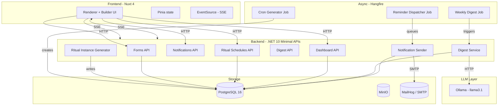
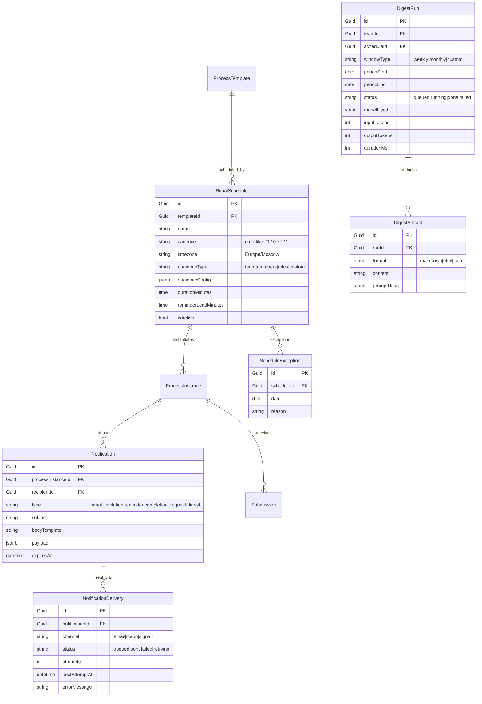

# DreamTeam Architecture

> Form-first rituals platform для ТимЛида / ТехЛида / СквадЛида.
> Лид один раз копирует пресет → привязывает к команде → выбирает cadence → система сама открывает инстанс, рассылает приглашения выбранной аудитории, агрегирует ответы, рисует дашборд и формирует weekly digest через локальный LLM.

Версия: **v2** (Army Knife). Базовый form engine v1 см. в `docs/architecture-v1.md` (историческая зафиксированная версия). v2 расширяет v1 тремя новыми модулями поверх существующего form engine.

## Позиционирование

**Army knife для ТимЛида**, в которой 1-1, daily, retro, OKR check-in, skill wheel review, и любые кастомные процессы — это пресетные формы, настроенные на расписание. Не бот в чужом мессенджере (как Standuply / Geekbot / Dailybot) — самостоятельный rituals hub.

**Три новых модуля** поверх form engine:
1. **Ritual Scheduler** — расписание, аудитория, таймзона, авто-инстансы
2. **Notification Pipeline** — email/in-app/SignalR уведомления с retry и очередью
3. **Team Dashboard** — агрегаты ответов по team players, статусы, риски
4. **AI Digest** — киллер-фича: плановый анализ активности + структурированный summary через LLM

## Стек

| Слой | Технология | Обоснование |
|---|---|---|
| **Backend** | .NET 10 (LTS до 14.11.2028) + Minimal APIs + EF Core 10 | LTS, Complex Types для JSONB, встроенная валидация, OpenAPI 3.1 |
| **Frontend** | Nuxt 4 (стабилен с 16.07.2025; Nuxt 3 EOL 31.07.2026) + Vue 3 | Schema-driven rendering, VeeValidate + Zod, shadcn-vue на Reka UI |
| **Database** | PostgreSQL 16 + JSONB (через EF Core 10 Complex Types) | GIN + jsonb_path_ops для аналитики, без EAV |
| **Auth** | ASP.NET Core Identity + JWT + refresh rotation | Self-hosted, без зависимости от внешних IdP |
| **Scheduler** | Hangfire (Postgres storage) | Persistent + dashboard + cluster; Quartz.NET — overkill |
| **Email** | MailKit + FluentEmail (Razor templates) | SendGrid / SMTP / Mailgun через abstraction |
| **Realtime** | SSE (MVP-2) → SignalR + Redis backplane (v4) | SSE дешевле для unidirectional push |
| **Attachments** | MinIO (S3-compatible) | Self-host, presigned URLs |
| **AI / LLM** | Ollama (llama3.1:8b-instruct) → vLLM (prod scale) | OpenAI-compatible API, swap без правок кода |
| **Background jobs** | Hangfire (тот же scheduler) | Persistent, retries, dashboard |

## Архитектурные слои



## Доменная модель

### Form engine (v1, без изменений)

`User`, `Team`, `TeamMembership`, `ProcessTemplate`, `FormVersion`, `ProcessInstance`, `Submission`, `Answer` — append-only submissions, snapshot-on-publish, JSONB schema с Zod-builder'ом. Подробности в v1 docs.

### Новые entities v2



**`RitualSchedule` отделён от `ProcessTemplate`**, потому что:
- Лид может переименовать ритуал без правки формы.
- Изменение cadence не ломает прошлые инстансы.
- Audience может быть динамическим (`audienceConfig`).

**`Notification` vs `NotificationDelivery`** — замысел vs попытка. Даёт retry, multi-channel, аналитику без боли.

**`DigestRun` vs `DigestArtifact`** — job-сущность vs результат. `DigestRun` хранит usage (tokens, duration), `DigestArtifact` — рендеренный контент с audit-trail через `promptHash`.

## Ritual Scheduler

### Генератор инстансов

Корневой Hangfire recurring-job раз в час сканирует активные расписания, для каждого вычисляет следующие 7 дней по cron, проверяет `ScheduleException` и существующие `ProcessInstance`, создаёт недостающие.

```csharp
public class RitualInstanceGeneratorJob
{
    public async Task GenerateUpcomingAsync(Guid scheduleId, CancellationToken ct)
    {
        var schedule = await db.RitualSchedules
            .Include(s => s.Template)
                .ThenInclude(t => t.FormVersions.Where(v => v.IsCurrent))
            .FirstAsync(s => s.Id == scheduleId, ct);

        var cron = CronExpression.Parse(schedule.Cadence);
        var currentForm = schedule.Template.FormVersions.First();

        for (var date = DateTime.UtcNow; date < DateTime.UtcNow.AddDays(7); date = date.AddDays(1))
        {
            var occurrence = cron.GetNextOccurrence(date.ToUniversalTime());
            if (occurrence == null) continue;
            var localTime = TimeZoneInfo.ConvertTimeFromUtc(occurrence.Value,
                TimeZoneInfo.FindSystemTimeZoneById(schedule.Timezone));

            if (await db.ScheduleExceptions.AnyAsync(e => e.ScheduleId == scheduleId
                && e.Date == localTime.Date, ct)) continue;
            if (await db.ProcessInstances.AnyAsync(p => p.ScheduleId == scheduleId
                && p.ScheduledAt == localTime, ct)) continue;

            db.ProcessInstances.Add(new ProcessInstance
            {
                ScheduleId = scheduleId,
                FormVersionId = currentForm.Id,
                TeamId = schedule.TeamId,
                ScheduledAt = localTime,
                Status = ProcessStatus.Planned
            });
        }
        await db.SaveChangesAsync(ct);
    }
}
```

### Per-schedule reminder

Отдельный Hangfire delayed job, который за `reminderLeadMinutes` до `scheduledAt` шлёт уведомление. Чтобы не плодить тысячи recurring-ов, scheduler enqueue-ит delayed-job на каждую аудиторию.

### Cadence

Cron-подобная строка (`'0 10 * * 1'` = каждый понедельник в 10:00) + `timezone`. Библиотека — **Cronos** (C#, pure managed).

Преимущества перед «Daily / Weekly / Monthly»:
- Custom bi-weekly (`0 14 * * 1/2`).
- Timezone explicit.
- Исключения через `ScheduleException` (праздники, отпуск).
- Отдельный `reminderLeadMinutes`.

**Почему Hangfire, не TickerQ / Coravel:** persistence, dashboard, кластеризация. Quartz.NET — overkill для MVP.

## Notification Pipeline

### Sender pipeline

Sender-сервис читает `Notification` без `NotificationDelivery` со статусом `sent`, для каждого канала создаёт `NotificationDelivery` и enqueue-ит в channel queue (MVP: `Channel<T>` из `System.Threading.Channels`; prod: Hangfire background job с retry).

**Каналы:**
- **email** — MailKit + FluentEmail (Razor templates). SMTP / SendGrid / Mailgun через `IEmailSender`.
- **in-app** — SSE (MVP-2) → SignalR `Clients.User(userId)` (v4).
- **signalr** — отдельный `Clients.Group("team:{teamId}")` для live activity feed (v4).

### Retry policy

```
1-я попытка: сразу
2-я: через 1 минуту
3-я: через 15 минут
4-я: через 1 час
5-я: через 6 часов
6-я: dead-letter
```

### Notification template registry

```csharp
public class NotificationTemplate
{
    public string Type { get; set; }     // "ritual_invitation"
    public string Subject { get; set; }
    public string EmailBody { get; set; } // Razor template
    public string InAppBody { get; set; }
}
```

Templates хранятся в БД, не в коде. Лид может кастомизировать формулировки без деплоя.

## Team Dashboard

Read-only проекция над `Submission` + `ProcessInstance` через Postgres + JSONB.

```csharp
group.MapGet("/teams/{teamId:guid}/status", async (Guid teamId, AppDbContext db) =>
{
    var status = await db.ProcessInstances
        .Where(p => p.TeamId == teamId && p.ScheduledAt < DateTime.UtcNow)
        .OrderByDescending(p => p.ScheduledAt)
        .GroupBy(p => p.ScheduleId)
        .Select(g => g.First())
        .Select(p => new {
            p.Id,
            p.ScheduleId,
            p.ScheduledAt,
            p.Status,
            SubmissionCount = p.Submissions.Count,
            ExpectedCount = p.Schedule.AudienceSize,
            CompletionRate = (double)p.Submissions.Count / p.Schedule.AudienceSize
        })
        .ToListAsync();
    return TypedResults.Ok(status);
});
```

### Виджеты

| Виджет | Назначение | Метрика/источник |
|---|---|---|
| **Team health pulse** | Energy / mood тренд за неделю | avg(rating) по submissions с rating-полем |
| **Completion rate** | % заполнивших последний ритуал | submissions / expected audience |
| **Blockers feed** | Live список blockers из submissions | jsonb @> "blockers != empty" |
| **1-1 overdue** | 1-1, которые не состоялись вовремя | processInstance.status=Planned && scheduledAt < now-7d |
| **Skill wheel drift** | Self vs target delta по competency | submissions с skill_wheel типом |
| **OKR at-risk count** | Сколько KR on-track/behind/at-risk | submissions с OKR check-in типом |
| **Recent activity** | Live feed событий | SSE activity feed |

Правило 8-12 виджетов, split 50/50 между delivery/quality/risk. Никаких per-person графиков в публичной части — только для lead/PM.

## AI Digest (киллер-фича)

### Что делает

**На вход:** submissions за период (default 7 дней), team-метаданные, template-метаданные, goals/OKR.
**На выход:** структурированный markdown:
- TL;DR (3 bullet points)
- Highlights / Concerns / Blockers
- Suggested actions
- Per-team-player sentiment (anonymized)
- Trending topics

### Pipeline

1. **Aggregation** (на бэке, без LLM) — собираем submissions, считаем метрики.
2. **Context building** — формируем структурированный JSON-context.
3. **Prompt + LLM call** — OpenAI-compatible interface.
4. **Validation** — парсим ответ, проверяем секции, длины, hallucinated user-ids.
5. **Storage** — `DigestArtifact` с `promptHash` для audit.
6. **Delivery** — `Notification` типа `digest`.

### LLM провайдер

| Провайдер | Когда |
|---|---|
| **Ollama (llama3.1:8b-instruct)** | MVP, dev, small teams — self-hosted, без внешних зависимостей |
| **vLLM** | Production scale, GPU available, concurrent digests > 5 |
| **OpenAI / Anthropic cloud** | Если customer хочет GPT-4-class quality |

MVP-выбор: **Ollama** через OpenAI-compatible API, `llama3.1:8b-instruct` в Q4_K_M. Достаточно для 50-100 submissions, latency 5-15 секунд.

### System prompt

```
You are an AI assistant for engineering team leaders. You receive a JSON 
context describing a team's ritual responses over the past 7 days and 
produce a structured markdown digest.

Output structure (required):
## TL;DR
- 3 bullet points: most important signal, biggest risk, positive note
## Highlights
- 2-4 bullets, each citing specific submission evidence
## Concerns
- 2-4 bullets, each with severity (low/med/high) and pattern
## Blockers
- Top 3 blockers across submissions, with who reported and when
## Suggested actions
- 1-3 concrete actions, each with owner suggestion and deadline suggestion
## Team sentiment
- Aggregate energy/mood signal with trend (rising/falling/stable)
## Trending topics
- 3-5 recurring themes from free-text fields

Constraints:
- Do not invent user names or ticket numbers not in context
- Reference submission IDs (e.g., "sub_abc123") for every claim
- Keep total length under 600 words
- Use the language of the team's primary locale (default: en)
- Return ONLY markdown, no preamble or explanation
```

### Privacy и cost

**Privacy:** self-hosted Ollama — данные не покидают нашу БД. **Major selling point.**
**Cost:** `inputTokens` + `outputTokens` в `DigestRun`, лид видит «digest стоил $0.04» для cloud-провайдеров.
**Rate limiting:** кэш `promptHash` на 24h.

## Storage

### PostgreSQL + JSONB

EF Core 10 Complex Types для JSONB-маппинга. `FormVersion.Schema` и `Submission.Data` хранятся как `jsonb`.

### Append-only submissions

`Submission` immutable. `Answer` — альтернативная нормализованная проекция для горячих аналитических запросов (если нужна).

### Индексация

```sql
-- GIN с jsonb_path_ops для containment (90% кейсов)
CREATE INDEX idx_submissions_data_gin
  ON submissions USING GIN (data jsonb_path_ops);

-- Expression B-tree для частых запросов по ключу
CREATE INDEX idx_submissions_template
  ON submissions ((data->>'templateId'));
```

`jsonb_path_ops` — индекс на 37% меньше, `@>` на 20-25% быстрее, write-overhead ниже.

### Attachments

MinIO (S3-compatible). `Submissions.Data` хранит только URL+метаданные.

## Self-hosted deployment

```yaml
# infra/docker-compose.yml
services:
  api:        # .NET 10 Minimal APIs + Hangfire dashboard
  web:        # Nuxt 4
  postgres:   # shared DB
  minio:      # attachments
  redis:      # SignalR backplane (multi-instance, v4)
  ollama:     # AI digest LLM (optional, через docker-compose.ollama.yml)
  mailhog:    # dev email catcher (prod: реальный SMTP/SendGrid)
```

Ollama-образ тянет модель при первом старте (`ollama pull llama3.1:8b` через init-скрипт).

## Архитектурные принципы

1. **Form is data, not code** — форма = JSON в `FormVersion.Schema`, рендерер generic.
2. **Snapshot-on-publish** — каждая `ProcessInstance` указывает на конкретную `FormVersion`.
3. **Append-only submissions** — исправления = новые строки, никогда `UPDATE`.
4. **Field registry** — новые типы полей через регистрацию компонента + схемы.
5. **Preset-as-form** — 1-1, Daily, Retro, Skill Wheel, OKR = копируемые пресеты.
6. **Schedules are first-class** — `RitualSchedule` отделён от `ProcessTemplate`.
7. **Notifications are intents, not sends** — `Notification` отделён от `NotificationDelivery`.
8. **AI is pluggable, data is sovereign** — digest через `IDigestLlm` интерфейс, данные не покидают БД.

## Конкурентное позиционирование

| Конкурент | Что делает | Наш дифференциатор |
|---|---|---|
| Standuply / Geekbot | Standup-боты в Slack/Teams | Web-app, не бот. Self-hostable. AI digest |
| monday.com Daily Standup | Standup внутри monday | Form-first, любая структура, не привязан к JIRA |
| Typeform / Tally / Form.io | Form-builder, нет rituals | Scheduling + audience + digest. Не просто форма |
| Range / Lattice / 15Five | Performance + rituals | Army knife, не performance tool |
| Notion + Zapier | DIY rituals | Коробочное решение с правильными дефолтами |

**Позиционирование одним предложением:** *«Army knife для ТимЛида: сделал форму один раз — система сама рассылает её команде по расписанию, агрегирует ответы, рисует дашборд и формирует weekly digest через локальный LLM»*.

## Открытые вопросы для архитектора

1. **Email delivery: SMTP stub или реальный провайдер в MVP-2?** → SMTP через MailHog в dev, настраивается в prod.
2. **Audience resolution: snapshot vs live?** → snapshot для аудитории, live для проверки доступа.
3. **Digest frequency: weekly only или configurable?** → MVP-2 weekly fixed, v3 configurable.
4. **AI digest: per-team или per-lead?** → оба, toggle в настройках.
5. **SignalR: включать в MVP-2 или оставить на v4?** → SSE в MVP-2, SignalR в v4.
6. **Ollama: включать в docker-compose или нет?** → опциональный сервис через `docker-compose.ollama.yml`.

## Документы

- `docs/architecture-v1.md` — v1 (form engine без rituals/notification/dashboard/digest) — зафиксированная история
- `docs/architecture.md` — этот файл, v2 (полная архитектура)
- `docs/roadmap.md` — roadmap по спринтам
- `docs/processes.md` — каталог пресетов процессов
