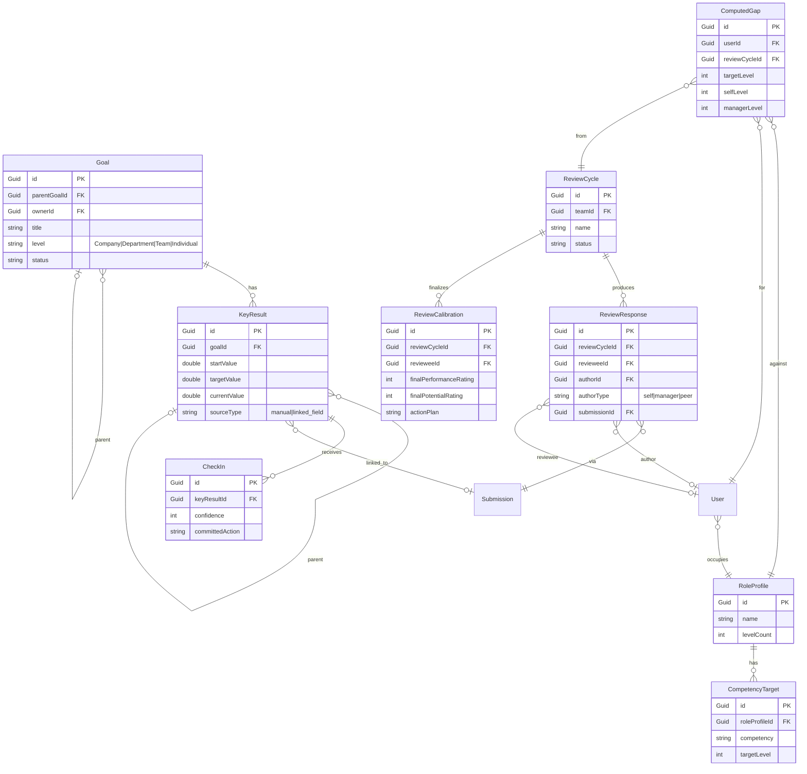

# Deep Cases: Skill Wheel, OKR, Performance Review

> Как три ключевых кейса реализуются внутри архитектуры v2 (form engine + rituals + notification + dashboard + AI digest). Без новых модулей и интеграций — только то, что уже зафиксировано.

## Главный тезис

Все три кейса (Skill Wheel, OKR, Performance Review) — это **не отдельные фичи**, а **разные режимы использования существующего form engine** с разной поддержкой в notification pipeline и team dashboard. Form schema и ProcessTemplate, плюс пара узкоспециализированных entities (`Goal`, `ReviewCycle`), закрывают 90% функциональности, которую в классических performance tools делат за десятки тысяч строк кода.

**Что НЕ добавляется:**
- Никаких интеграций с Jira / GitHub / Notion.
- Никаких внешних AI-сервисов.
- Никаких новых transport-каналов (только email + in-app SSE, как в v2).

**Что добавляется:**
- 2 узкоспециализированные entities: `Goal` (с поддержкой иерархии), `ReviewCycle` (для quarterly/annual review).
- 3-4 новых DSL-типа полей (целиком через field-registry, без форка движка).
- 3-4 новых dashboard-виджета поверх существующих submissions.

---

## 1. Skill Wheel: глубокий дизайн

### 1.1 Что это на самом деле

Skill Wheel в нашей модели — это **не один тип формы**, а **связка из трёх artifact-ов**, которая работает как единый ритуал:

1. **Role Profile** — целевые уровни по компетенциям для конкретной роли.
2. **Self-Assessment** — submission автора на свои компетенции.
3. **Manager Review** (опционально) — submission лида на того же человека.

Gap = `target - observed`. На этом строится Individual Development Plan (IDP). Минимум для defensible gap — self + manager. 360 (peers, direct reports) добавляется в v4 как расширение [1][2].

**Критичные best practices из research:**
- Self-only rating overstates by ~0.5 уровень. Без second rater gap — это opinion, а не data [1][2].
- 1-2 цели в IDP, не пять. Development requires sustained attention over weeks [1].
- 360 rater group avg показывается только при N≥3 raters, иначе merges в overall [3][4].
- 5-7 raters per group — sweet spot [2][3].

### 1.2 Role Profile

```csharp
public class RoleProfile
{
    public Guid Id { get; set; }
    public string Name { get; set; }              // "Senior Backend Engineer"
    public Guid? ParentRoleId { get; set; }       // иерархия ролей (необязательно)
    public int LevelCount { get; set; }            // 3, 4, 5 — сколько уровней на шкале
    public List<CompetencyTarget> Targets { get; set; }  // см. ниже
}

public class CompetencyTarget
{
    public Guid Id { get; set; }
    public Guid RoleProfileId { get; set; }
    public string Category { get; set; }           // "Technical depth"
    public string Competency { get; set; }        // "Backend systems"
    public int TargetLevel { get; set; }           // 3 из 5
    public string BehaviorAnchors { get; set; }   // JSON: { "0": "...", "3": "...", "5": "..." }
}
```

`RoleProfile` — это **шаблон роли**, живёт в каталоге компании. Лиды/HR редактируют, пользователи выбирают свою роль в `User.ProfileId`. Один пользователь — одна роль, иерархия ролей — это tree по `ParentRoleId` (Senior IC → IC, Manager → Senior IC, Director → Manager).

### 1.3 Skill Wheel как тип поля

`skill_wheel` — это **уже зафиксированный custom field type** из v2. Здесь мы его уточняем.

**DSL:**
```json
{
  "id": "competencies",
  "type": "skill_wheel",
  "label": "Self-assessment",
  "categories": [
    "Technical depth",
    "Product thinking",
    "Collaboration",
    "Delivery"
  ],
  "competencies": [
    { "id": "td", "label": "Technical depth", "category": "Technical depth" },
    { "id": "pt", "label": "Product thinking", "category": "Product thinking" },
    { "id": "co", "label": "Collaboration", "category": "Collaboration" },
    { "id": "dl", "label": "Delivery", "category": "Delivery" }
  ],
  "scale": 5,
  "evidenceRequired": true,
  "evidenceSchema": { "type": "longtext", "minLength": 20 }
}
```

**Submission data shape (jsonb):**
```json
{
  "competencies": {
    "td": { "level": 3, "evidence": "Led migration of payments service..." },
    "pt": { "level": 2, "evidence": "..." },
    "co": { "level": 4, "evidence": "..." },
    "dl": { "level": 3, "evidence": "..." }
  },
  "overall_self_confidence": 4
}
```

Zod-builder для этого типа:
```typescript
const skillWheelSchema = z.object({
  competencies: z.record(
    z.string(),
    z.object({
      level: z.number().int().min(0).max(5),
      evidence: z.string().min(20)
    })
  )
});
```

Серверная C#-валидация: тот же контракт через NJsonSchema → JsonSchema → Validator. Гарантирует, что клиент не подменит level или обойдёт evidence-валидацию.

### 1.4 Process flow: Skill Wheel Review (quarterly)

| Шаг | Что происходит | Какие entities задействованы |
|---|---|---|
| 1. PM/Director создаёт `RitualSchedule` | Cadence `0 10 1 */3 *`, audience = members, audienceConfig = all members of teams | `RitualSchedule`, `ProcessTemplate` (preset "Skill Wheel Quarterly") |
| 2. Scheduler генерирует `ProcessInstance` | По одному на каждого члена команды, на 1-е число квартала | `ProcessInstance` × N |
| 3. Self-Assessment reminder | За 7 дней email + in-app "Submit self-assessment" | `Notification` × N |
| 4. Member заполняет форму | `Submission` от `author = user` → snapshot формы vN | `Submission` (self) |
| 5. Manager Review reminder (если включён) | Через 2 дня после self-deadline, lead получает notification | `Notification` × M (lead на каждого report) |
| 6. Lead заполняет manager version | `Submission` от `author = lead` → linked через `ReviewCycle` | `Submission` (manager) |
| 7. Compute gap | Сравнение self vs target, manager vs target, self vs manager | `ComputedGap` (новая entity) |
| 8. Aggregate в team-level signal | Dashboard виджет "Team skill distribution" | Материализованная view |
| 9. Quarterly AI digest | Лид получает "team competency shift over quarter" | `DigestRun` (расширение §4 v2) |

### 1.5 Computed Gap

```csharp
public class ComputedGap
{
    public Guid Id { get; set; }
    public Guid UserId { get; set; }              // кого оцениваем
    public Guid ReviewCycleId { get; set; }      // связь с quarterly cycle
    public string CompetencyId { get; set; }     // "td", "pt"...
    public int? TargetLevel { get; set; }        // из RoleProfile
    public int? SelfLevel { get; set; }
    public int? ManagerLevel { get; set; }
    public int? GapTargetSelf { get; set; }      // target - self
    public int? GapTargetManager { get; set; }   // target - manager
    public int? GapSelfManager { get; set; }     // self - manager (blind spot signal)
    public string SelfEvidence { get; set; }
    public string ManagerEvidence { get; set; }
    public DateTime ComputedAt { get; set; }
}
```

Computed в момент, когда оба submission-а (self + manager) получены. Triggered через Hangfire job после `Session.SelfDeadline` + `Session.ManagerDeadline`. Append-only (как и все submissions-derived entities), пересчитывается только при новой итерации цикла.

### 1.6 Dashboard виджеты для Skill Wheel

| Виджет | Источник | Что показывает |
|---|---|---|
| **Skill distribution** | Все `ComputedGap` для команды | Heatmap: competency × team member, цвет = gap |
| **Self-manager agreement** | `ComputedGap.GapSelfManager` | Scatter plot: где blind spots (self > manager на 1+) |
| **Top 3 gaps across team** | Агрегация по `GapTargetSelf > 0` | Leaderboard: competency → team count needing work |
| **Skill trajectory** | `ComputedGap` за 4 последних квартала | Line chart per competency: avg gap over time |
| **Personal IDP target** | Latest `ComputedGap` для текущего пользователя | Top 1-2 gaps + suggested next action |

Все виджеты — **read-only projections** через EF Core 10 LINQ на `ComputedGap` (или JSONB aggregation на `Submission.data` для тех, у кого ещё нет cycle).

### 1.7 Что НЕ входит (в рамках MVP-2)

- **360° multi-rater**: 5 rater groups, anonymity по N≥3 — это v4. В MVP-2 только self + manager.
- **Анонимизация per-rater**: только manager видим отдельно, peers / direct reports — в v4.
- **Calibration sessions (9-box)**: см. §3.

---

## 2. OKR: глубокий дизайн

### 2.1 Доменная модель

```csharp
public class Goal
{
    public Guid Id { get; set; }
    public Guid? ParentGoalId { get; set; }     // иерархия: company → dept → team
    public Guid? ParentKeyResultId { get; set; } // опционально: cascade под KR
    public string Title { get; set; }            // "Accelerate revenue growth"
    public string Description { get; set; }
    public GoalLevel Level { get; set; }         // Company | Department | Team | Individual
    public Guid OwnerId { get; set; }            // один ответственный
    public Guid TeamId { get; set; }              // scope
    public GoalStatus Status { get; set; }       // Draft | Active | AtRisk | Achieved | Missed
    public DateTime PeriodStart { get; set; }
    public DateTime PeriodEnd { get; set; }      // quarter / half / year
    public DateTime CreatedAt { get; set; }
}

public class KeyResult
{
    public Guid Id { get; set; }
    public Guid GoalId { get; set; }
    public string Title { get; set; }            // "Reduce churn from 8% to 4%"
    public string Unit { get; set; }             // "percent", "count", "USD"
    public double StartValue { get; set; }
    public double TargetValue { get; set; }
    public double CurrentValue { get; set; }     // пересчитывается из CheckIn-ов
    public double? ExpectedPace { get; set; }    // computed: (t-1)/(T_total-1) * (target-start) + start
    public string SourceType { get; set; }       // "manual" | "linked_field"
    public Guid? SourceFieldId { get; set; }      // если linked: тянем из submission.data
    public Guid OwnerId { get; set; }
}

public class CheckIn
{
    public Guid Id { get; set; }
    public Guid KeyResultId { get; set; }
    public DateTime WeekStart { get; set; }       // начало недели (ISO week)
    public double? CurrentValue { get; set; }     // optional override
    public int Confidence { get; set; }          // 1-10
    public string Note { get; set; }              // "Shipped X, blocked by Y"
    public string Blockers { get; set; }         // explicit field, max 280 chars
    public string CommittedAction { get; set; }   // "By next Mon: ship Z"
    public DateTime SubmittedAt { get; set; }
    public Guid AuthorId { get; set; }
}
```

**Структура:** Goal = parent node, KeyResult = measurable child, CheckIn = weekly snapshot. `ParentGoalId` и `ParentKeyResultId` дают два режима каскада: под Objective или под конкретный KR [5][6][7]. **Современная best practice — bottom-up alignment, не top-down cascade**: teams сами определяют свои KRs и link-up через `ParentKeyResultId` [5].

### 2.2 Status computation (Pace, не flat threshold)

**Confidence (1-10):** вводится человеком, простая шкала.
**Pace:** `expectedPace(t) = start + (target - start) * (t - periodStart) / (periodEnd - periodStart)`. Сравниваем с `currentValue`. Status:

- **on-track**: `currentValue >= expectedPace * 0.9`
- **behind**: `expectedPace * 0.7 <= currentValue < expectedPace * 0.9`
- **at-risk**: `currentValue < expectedPace * 0.7` ИЛИ `confidence <= 3` два раза подряд
- **achieved**: `currentValue >= target`

Это даёт объективный status, не "feels worried" [8][9][10]. **Confidence** остаётся separate signal — может падать при росте progress (ранние вины маскируют риск) [9][11].

### 2.3 Linked Key Results: KR как projection на submission

`KeyResult.SourceType = "linked_field"` — это killer-фича MVP-2. Поле `SourceFieldId` указывает на field в `Submission.data` другой формы. Примеры:

- KR "ship 10 features this quarter" — линкуется на `count(features)` в `Submission.data` пресета "Sprint Review".
- KR "achieve 95% test coverage" — линкуется на `coverage` в submission от "Sprint Health".
- KR "onboard 5 new customers" — линкуется на `count(customers)` в submission "Customer Pulse".

```csharp
public class LinkedFieldMapping
{
    public Guid KeyResultId { get; set; }
    public string Aggregation { get; set; }      // "sum" | "avg" | "count" | "latest"
    public string AggregationField { get; set; } // "count", "score", "value"
    public string FilterJson { get; set; }       // jsonb: "data.status == 'done'"
}
```

Hangfire job пересчитывает `KeyResult.CurrentValue` раз в час: aggregate `Submission.data` где `FormVersion.field.id == SourceFieldId`, применить filter, apply aggregation, записать.

Это **закрывает integration-эффект без интеграций** — KR live-update из существующих submissions. Если у вас уже есть "Sprint Review" preset и лиды в нём отмечают "shipped features", эти данные автоматически кормят OKR.

### 2.4 Process flow: weekly OKR check-in

| Шаг | Что | Когда |
|---|---|---|
| 1 | `RitualSchedule` для OKR Check-in | Cadence `0 9 * * 1` (каждый понедельник 09:00) |
| 2 | Scheduler создаёт `ProcessInstance` | За неделю до check-in |
| 3 | Reminder | За 30 мин |
| 4 | Owner открывает форму | Форма: matrix `kr_progress` с автозаполнением из linked fields, плюс `confidence`, `note`, `blockers`, `committed_action` per KR |
| 5 | Owner заполняет | `Submission.data = { kr_progress: [{ krId, current, confidence, note, blockers, action }], week: "2026-W34" }` |
| 6 | Server-side aggregation | Из `Submission.data` создаются `CheckIn`-ы, пересчитываются `KeyResult.CurrentValue` и `Status` |
| 7 | Dashboard update | "OKR at-risk count" виджет пересчитывается |
| 8 | Friday digest (опционально) | Если cron = Friday: weekly summary "what's at risk" |

**Форма OKR Check-in (уточнённая):**

```json
{
  "pages": [
    {
      "id": "kr_update",
      "title": "Per-KR update",
      "elements": [
        {
          "id": "kr_progress",
          "type": "matrix",
          "label": "Update per key result",
          "rowsSource": "team.active_goals.key_results",
          "columns": [
            { "id": "current", "label": "Current", "type": "number", "prefill": "linkedFieldValue" },
            { "id": "status", "label": "Status", "type": "select",
              "options": ["on-track", "behind", "at-risk"],
              "prefill": "computedFromPace" },
            { "id": "confidence", "label": "Confidence 1-10", "type": "rating", "scale": 10, "required": true },
            { "id": "moved", "label": "What moved it?", "type": "longtext", "required": true }
          ]
        }
      ]
    },
    {
      "id": "blockers",
      "title": "Blockers & next week",
      "elements": [
        { "id": "blockers", "type": "longtext", "label": "What's blocking?" },
        { "id": "next_week", "type": "longtext", "label": "Specific action you commit to before next check-in" }
      ]
    }
  ]
}
```

`prefill: "linkedFieldValue"` и `prefill: "computedFromPace"` — это **новая фича DSL-типов**: поля могут быть pre-populated из подключённых источников. Renderer показывает значение, user может override (если знает точнее).

### 2.5 Mid-quarter alignment review

**Через 6 недель квартала** — отдельный ritual (ежеквартальный, разовый). PM/Director получает отчёт:
- Tree visualization: `Goal → KR` с цветом по status
- Gaps: KR, у которых нет owner
- Coverage: ветки без KR (organisation/team не закрывает)
- Cross-team dependencies: KRs из разных команд, ссылающиеся на один parent KR

Это **не** AI digest — это **pure query** через `Goal` tree с цветовой разметкой. Делается за 1 SQL-запрос + D3-tree-renderer на фронте. Заменяет 90% функциональности 9-box, но в координатах OKR.

### 2.6 Dashboard виджеты для OKR

| Виджет | Источник | Что показывает |
|---|---|---|
| **OKR tree (стратегическая карта)** | `Goal` hierarchy | Tree с цветом по status, drilldown до KR |
| **At-risk count** | `KeyResult` где status=AtRisk | Counter, click → список |
| **Confidence trend** | `CheckIn` за 4 недели | Sparkline per KR |
| **Pace vs progress scatter** | `KeyResult.ExpectedPace` vs `CurrentValue` | Scatter: где progress норм, но pace отстаёт |
| **Linked-field freshness** | `Submission` count feeding each linked KR | "Last data point: 3 days ago" indicator |

---

## 3. Performance Review: глубокий дизайн

### 3.1 Разделение performance и 360

**Из research, важно:** Performance Review и 360 — **разные инструменты** с разными вопросами [3][12]:
- Performance Review: "hit the targets?" (outcomes, goals)
- 360: "how does this person lead?" (behaviors, competencies)

Мы разделяем их явно. В MVP-2 — только Performance Review. 360 — v4 (как расширение Skill Wheel Review).

### 3.2 Review Cycle

```csharp
public class ReviewCycle
{
    public Guid Id { get; set; }
    public string Name { get; set; }              // "Q3 2026 Performance Review"
    public Guid TeamId { get; set; }
    public DateTime PeriodStart { get; set; }
    public DateTime PeriodEnd { get; set; }
    public DateTime SelfDeadline { get; set; }
    public DateTime ManagerDeadline { get; set; }
    public DateTime CalibrationDate { get; set; } // when managers meet
    public ReviewStatus Status { get; set; }      // Setup | SelfInProgress | ManagerInProgress | Calibration | Done
    public Guid CreatedById { get; set; }
}

public class ReviewResponse
{
    public Guid Id { get; set; }
    public Guid ReviewCycleId { get; set; }
    public Guid RevieweeId { get; set; }         // кого оценивают
    public Guid AuthorId { get; set; }           // кто оценивает (==RevieweeId для self)
    public string AuthorType { get; set; }       // "self" | "manager" | "peer" | "skip-level" (v4)
    public Guid? FormVersionId { get; set; }     // snapshot of form used
    public Guid SubmissionId { get; set; }       // form submission с ответами
    public DateTime SubmittedAt { get; set; }
}

public class ReviewCalibration
{
    public Guid Id { get; set; }
    public Guid ReviewCycleId { get; set; }
    public Guid RevieweeId { get; set; }
    public int FinalPerformanceRating { get; set; }   // 1-5
    public int FinalPotentialRating { get; set; }     // 1-3 (low/medium/high)
    public string BoxLabel { get; set; }               // "Future Star", "Solid Contributor"...
    public string ActionPlan { get; set; }            // markdown: what happens next
    public DateTime CalibratedAt { get; set; }
    public List<Guid> CalibratedByIds { get; set; }    // managers who participated
    public bool SharedWithReviewee { get; set; }       // calibration is confidential by default
}
```

`ReviewCycle` — это quarter/yearly setup, который координирует sequence шагов. `ReviewResponse` — submission, привязанный к cycle. `ReviewCalibration` — финальное решение, принятое группой менеджеров.

### 3.3 Performance Review как процесс

Performance Review — это **multi-stage ritual**, не одна форма. Stages:
1. **Self-Review** (per reviewee, deadline +14 days).
2. **Manager Review** (per pair, deadline +21 days, after self).
3. **Calibration** (per team, single meeting, scheduled).
4. **Delivery** (per reviewee, 1-1 with manager).

**Multi-stage реализуется через несколько `ProcessTemplate`-ов** с shared `ReviewCycle`:
- `process_template_self_review` — linked to cycle
- `process_template_manager_review` — linked to cycle
- `process_template_calibration` — **не submission-driven**, а meeting-driven
- `process_template_1on1_delivery` — 1-1 между manager и reviewee (это готовый пресет 1-1, link через `review_cycle_id`)

Все 4 шага — это **отдельные ritual schedules**, которые активируются автоматически на разных этапах cycle (с `schedule.active_from` полем). Лид настраивает cycle один раз → система сама разворачивает 4 параллельных ritual-а для каждого члена команды.

### 3.4 Self-Review форма (template)

```json
{
  "pages": [
    {
      "id": "highlights",
      "title": "Highlights this period",
      "elements": [
        { "id": "wins", "type": "longtext", "label": "What were your most significant wins?",
          "required": true, "minLength": 100 },
        { "id": "okr_summary", "type": "okr_summary", "label": "OKR progress this period",
          "source": "user.assigned_goals", "prefill": true },
        { "id": "skill_wheel_summary", "type": "skill_wheel_summary",
          "label": "Competency shifts since last review",
          "source": "user.computed_gaps", "period": "this_cycle", "prefill": true }
      ]
    },
    {
      "id": "growth",
      "title": "Growth & gaps",
      "elements": [
        { "id": "growth_areas", "type": "longtext", "label": "Where did you grow most?" },
        { "id": "challenges", "type": "longtext", "label": "Where did you struggle?",
          "required": true },
        { "id": "support_needed", "type": "longtext", "label": "What support do you need from your manager?" }
      ]
    },
    {
      "id": "next_period",
      "title": "Goals for next period",
      "elements": [
        { "id": "next_focus", "type": "longtext", "label": "Top 3 priorities for next quarter",
          "required": true },
        { "id": "aspiration", "type": "longtext", "label": "Where do you want to be in 12 months?" }
      ]
    }
  ]
}
```

`okr_summary` и `skill_wheel_summary` — **новые custom field types** (через field-registry), которые автогенерируют prefill из существующих `Goal` и `ComputedGap`. Member не печатает, что уже знает система.

### 3.5 Manager Review форма

```json
{
  "pages": [
    {
      "id": "self_review_summary",
      "title": "Self-review alignment",
      "elements": [
        { "id": "self_review", "type": "static_text", "source": "linked.self_review.data",
          "label": "What your report wrote", "readonly": true }
      ]
    },
    {
      "id": "manager_assessment",
      "title": "Manager assessment",
      "elements": [
        { "id": "highlights", "type": "longtext", "label": "Significant wins observed" },
        { "id": "challenges", "type": "longtext", "label": "Where did they fall short?" },
        { "id": "skill_wheel_manager", "type": "skill_wheel",
          "competencies_from": "self_review.skill_wheel.competencies",
          "label": "Your assessment of their competencies" },
        { "id": "performance_rating", "type": "rating", "label": "Overall performance", "scale": 5 },
        { "id": "potential_rating", "type": "rating", "label": "Future potential (1-3)", "scale": 3 }
      ]
    },
    {
      "id": "calibration_inputs",
      "title": "For calibration",
      "elements": [
        { "id": "development_priorities", "type": "longtext", "label": "Top development priority" },
        { "id": "next_period_focus", "type": "longtext", "label": "Suggested focus next quarter" }
      ]
    }
  ]
}
```

`potential_rating: 1-3` — это **future potential axis** для 9-box. `performance_rating: 1-5` — current performance. Эти два значения — входные данные для calibration meeting.

### 3.6 Calibration meeting (synchronous, 90-120 min)

**Не** submission-driven процесс. Это **отдельный шаг**, который происходит оффлайн (или в zoom), но с structured support.

В системе:
- `ReviewCalibration` entity — финальное решение по каждому reviewee.
- Dashboard виджет "Calibration view" — показывает всех reviewees команды с self/manager ratings, anchor evidence, suggested box.
- Manager предварительно rate-ит async (свой `ReviewResponse` с типом `manager-pre-calibration`).
- На встрече менеджеры обсуждают, корректируют, фиксируют в `ReviewCalibration`.

**Рекомендации из research для calibration design** [12][13][14][15]:
- Каждый manager rate-ит **async** до встречи (с 50-word rationale per person) [12][14].
- На встрече начинают с Star box (самые ясные случаи) и Underperformer box [12][14].
- Facilitator challenge-ит placements без evidence [12][14].
- Demographic pattern review — обязателен [12][13][14].
- Action plan per person (development, succession, retention, exit) [12][13][14][15].
- **НЕ** сообщать box-label сотруднику — обсуждать как normal performance conversation [14][15].

### 3.7 9-box виджет на frontend

```vue
<template>
  <div class="nine-box">
    <div v-for="row in 3" :key="row" class="row">
      <div v-for="col in 3" :key="col" class="cell"
           :class="boxClass(row, col)">
        <div v-for="person in peopleAt(row, col)" :key="person.id"
             class="person-chip">
          {{ person.name }}
        </div>
      </div>
    </div>
  </div>
</template>
```

`boxClass(row, col)` — комбинация performance (col) × potential (row). Цвет фона: future star (зелёный) / core player (синий) / solid contributor (серый) / etc. Клик на человека → side panel с деталями (manager evidence, self evidence, gap, action plan).

### 3.8 Delivery 1-1 (закрытие цикла)

Это **обычный 1-1 пресет** из v2, привязанный к `ReviewCycle` через `process_metadata`. Лид берёт `ReviewCalibration` для каждого report-а, проводит 1-1, помечает как `delivered`.

**Важно:** calibration output (`ActionPlan`, `FinalPerformanceRating`) **не** показывается в форме, которую видит reviewee. Manager сам структурирует разговор.

### 3.9 Что НЕ входит в MVP-2

- **360 multi-rater**: v4
- **Self-rating inflation detection (analytics)**: nice-to-have, v3
- **Compensation linking**: out of scope (это HR-системы)
- **Promotions tracking**: out of scope (есть `Goal` cascade, можем link'нуть promotion goal, но не full workflow)

---

## 4. Сводная архитектура: как 3 кейса ложатся на entities



**Существующие entity из v1/v2, которые переиспользуются:**
- `ProcessTemplate` + `FormVersion` + `ProcessInstance` + `Submission` — для всех трёх кейсов.
- `RitualSchedule` + `ScheduleException` — для cadence (quarterly review, weekly check-in, quarterly skill wheel).
- `Notification` + `NotificationDelivery` — для reminders (self deadline, manager deadline, calibration prep).
- SSE channel — для in-app уведомлений.

**Новые entities (3):**
- `RoleProfile` + `CompetencyTarget` — для Skill Wheel.
- `Goal` + `KeyResult` + `CheckIn` — для OKR.
- `ReviewCycle` + `ReviewResponse` + `ReviewCalibration` — для Performance Review.

**Новые DSL-типы (через field-registry):**
- `okr_summary` — prefill из user.assigned_goals.
- `skill_wheel_summary` — prefill из user.computed_gaps за период.
- `static_text` (linked) — readonly отображение submission от другого ритуала.
- Расширение `matrix` типа — поддержка `rowsSource: "team.active_goals.key_results"` с prefill per column.

---

## 5. Уточнения к существующему DSL и rendering

### 5.1 `prefill` для полей

Новый keyword в DSL-описании поля:
```json
{
  "id": "current",
  "type": "number",
  "prefill": "linkedFieldValue",
  "prefillSource": "kr.linked_field"
}
```

Renderer на клиенте при mount запрашивает преfill через `GET /api/v1/fields/{id}/prefill?context=...`. Backend вычисляет значение (для `linkedFieldValue` — из текущего `KeyResult.CurrentValue`, для `computedFromPace` — по `ExpectedPace` формуле). User видит предзаполненное поле и может override.

### 5.2 Zod-builder extensions

Нужно добавить поддержку `prefill` в Zod-схему: тип поля фиксирован, но optional initial value. Это не ломает существующий код — просто новое свойство в DSL.

### 5.3 Server-side aggregation job

Один Hangfire job раз в час пересчитывает:
- `KeyResult.CurrentValue` для всех `linked_field` KR
- `KeyResult.Status` (on-track/behind/at-risk/achieved)
- `ComputedGap` для всех completed (self+manager) submissions за последний cycle

Snapshot-семантика: ComputedGap не обновляется задним числом, только создаётся новая запись при новом cycle. `KeyResult.CurrentValue` обновляется in-place (это derived state, не fact).

---

## 6. Privacy и security

### 6.1 Self-review vs manager review

- **Self-review** видит: только `self` (до `SubmittedAt`), потом и `manager` (после `SubmittedAt` менеджера).
- **Manager review** видит: self + свой собственный draft.
- **Calibration output** видит: только manager + PM (НЕ reviewee).
- **Action plan** после 1-1: виден manager и reviewee (через 1-1 форму).

Это **role-based access control** поверх `ReviewResponse` — `AuthorizationHandler<ReviewResponse>` проверяет claim `user.id` против `authorId` или `revieweeId` + role.

### 6.2 9-box confidentiality

Per research: **box-label НЕ сообщается сотруднику** [12][14][15]. В нашей системе `ReviewCalibration.SharedWithReviewee = false` по умолчанию. Manager в 1-1 может рассказать verbally, но в UI reviewee видит только `finalPerformanceRating` (1-5) и `actionPlan` (что лид сам ввёл в свободной форме).

### 6.3 Linked KR privacy

`Submission.data` содержит sensitive responses (blockers, 1-1 notes). Когда `KeyResult.SourceFieldId` указывает на поле в submission, **только агрегаты** (sum, avg, latest) вычисляются, не сырые данные. Это контракт на уровне `LinkedFieldMapping`:
- `aggregation: "avg"` → можно
- `aggregation: "raw_value"` → нельзя (такой опции нет в enum)

### 6.4 Append-only для review-data

`ReviewResponse` и `ReviewCalibration` immutable, как и `Submission`. Пересчёт → новая запись. Audit-trail через `promptHash`/`submission_id` references.

---

## 7. Dashboard виджеты: сводная таблица

| Виджет | Источник | Кейс | Описание |
|---|---|---|---|
| Team health pulse | `Submission` (rating fields) | Общий | Avg energy/mood за неделю |
| Completion rate | `Submission` count vs audience | Общий | % заполнивших последний ритуал |
| Blockers feed | `Submission.data @> "blockers != empty"` | Общий | Live list blockers |
| 1-1 overdue | `ProcessInstance` overdue | Общий | Какие 1-1 не состоялись |
| **Skill distribution** | `ComputedGap` | Skill Wheel | Heatmap competency × member |
| **Self-manager agreement** | `ComputedGap.GapSelfManager` | Skill Wheel | Scatter: blind spots |
| **Top 3 team gaps** | Aggregate `ComputedGap` | Skill Wheel | Leaderboard |
| **Skill trajectory** | `ComputedGap` per quarter | Skill Wheel | Line chart per competency |
| **Personal IDP** | Latest `ComputedGap` for user | Skill Wheel | Top 1-2 gaps + suggestion |
| **OKR tree** | `Goal` hierarchy | OKR | Tree с цветом по status |
| **At-risk count** | `KeyResult.Status = AtRisk` | OKR | Counter + drilldown |
| **Confidence trend** | `CheckIn` per KR | OKR | Sparkline 4 недели |
| **Pace vs progress** | `KeyResult.ExpectedPace` vs current | OKR | Scatter |
| **Linked freshness** | Last `Submission` per source field | OKR | "3 days ago" indicator |
| **Calibration view** | `ReviewResponse` aggregated | Perf Review | Side-by-side self vs manager |
| **9-box grid** | `ReviewCalibration` | Perf Review | 3×3 matrix with people chips |
| **Action plan status** | `ReviewCalibration.ActionPlan` | Perf Review | Delivered Y/N per reviewee |

**Итого: 17 виджетов, из них 12 новых для трёх кейсов + 5 базовых из v2.** Укладывается в правило 8-12 на страницу — разбиваем на 3-4 dashboard-страницы (Overview, Skill Wheel, OKR, Performance).

---

## 8. Последовательность внедрения в MVP-2

| Sprint | Что | Entities |
|---|---|---|
| Sprint 3 | Базовые entities v2, без новых | (existing v2) |
| Sprint 4 | Goal + KeyResult + CheckIn (OKR core) | Goal, KeyResult, CheckIn |
| Sprint 5 | Linked-field aggregation job; OKR presets | (job) |
| Sprint 6 | RoleProfile + CompetencyTarget; Skill Wheel preset; ComputedGap job | RoleProfile, CompetencyTarget, ComputedGap |
| Sprint 6 (parallel) | ReviewCycle + ReviewResponse; Performance Review presets | ReviewCycle, ReviewResponse, ReviewCalibration |
| Sprint 7 | Calibration dashboard виджеты; 9-box; action plan workflow | (UI) |
| Sprint 7 (polish) | Performance review delivery 1-1 link | (process) |

**MVP-2 к концу Sprint 7 закрывает все три кейса end-to-end без интеграций и без внешних AI-services.**

---

## 9. Открытые вопросы

**Q1. `RoleProfile` редактируется кем?**
PM? HR? Director? Рекомендация: **HR** создаёт и редактирует role profiles, **PM** выбирает профиль для своего пользователя, **self-service** для update своей роли (с approval).

**Q2. Multi-role: один пользователь — одна роль, или несколько?**
В реальности backend-инженер может также быть tech lead. Рекомендация: **primary role** (для default competency targets) + **secondary roles** (для additional competencies). На MVP-2 — только primary, multi-role в v3.

**Q3. `CheckIn.Note` обязателен?**
Research говорит: yes, every confidence score should have a note [8][9]. Рекомендация: **required, min 20 chars**. Это дисциплинирует.

**Q4. OKR cascade: top-down или bottom-up?**
Research: **bottom-up alignment** побеждает top-down cascade в реальности [5]. Рекомендация: реализуем оба, но **UI по умолчанию** = bottom-up (лид создаёт свои KR и link-up).

**Q5. Review cycle: only quarterly, или configurable (half-year, annual)?**
HR-практика: tech компании — quarterly, другие — annual. Рекомендация: **configurable** через `ReviewCycle.PeriodEnd - PeriodStart`, но UX-пресеты = quarterly / half-yearly / annual.

**Q6. 9-box: 3×3 или 4×4?**
3×3 — стандарт, проще объяснить, проверено десятилетиями [12][13][14]. Рекомендация: **3×3 в MVP-2**, 4×4 = v4 customization.

**Q7. Comp/level linking: out of scope или в MVP-2?**
Comp systems сильно варьируются (Lattice, Pave, HRIS). Рекомендация: **out of scope**, фокус на самом review. Интеграция — v4.

---

## 10. Архитектурные принципы (расширение v2)

Восемь принципов из v2 + пять новых для performance-домена:

1. **Form is data, not code** (v2)
2. **Snapshot-on-publish** (v2)
3. **Append-only submissions** (v2)
4. **Field registry** (v2)
5. **Preset-as-form** (v2)
6. **Schedules are first-class** (v2)
7. **Notifications are intents, not sends** (v2)
8. **AI is pluggable, data is sovereign** (v2)
9. **Self + manager = minimum defensible gap** — ниже этого уровня IDP = opinion, не data.
10. **Pace computed, not self-reported** — `expectedPace = start + (target-start) * (t-1)/(T-1)`, status from math.
11. **9-box label is confidential** — calibration output никогда не показывается reviewee verbatim.
12. **Linked fields, not integrations** — KR source = submission field reference, не external API.
13. **Multi-stage rituals as scheduled process chain** — Performance Review = 4 ProcessTemplate-а с shared ReviewCycle.

С этими 13 принципами DreamTeam закрывает **3 из топ-4 use case-ов performance-индустрии** (Skill Wheel, OKR, Performance Review) **без интеграций**, **без внешних AI-сервисов**, **без отдельных модулей** — только правильная композиция существующих.

---

## Источники

[1] https://www.huneetylearning.com/individual-development-plans/gap-analysis

[2] https://www.huneetylearning.com/blog/skills-gap-analysis-guide

[3] https://www.huneetylearning.com/360-assessment

[4] https://www.star360feedback.com/is-360-degree-feedback-anonymous

[5] https://www.tability.io/odt/articles/how-we-align-okrs-because-cascading-sucks

[6] https://kpitree.co/guides/how-to/align-okrs-across-teams

[7] https://docs.digital.ai/agility/docs/agility/cascading-okrs-new

[8] https://okrinstitute.org/okr-check-in-guide/

[9] https://okrstud.io/blog/confidence-is-not-progress

[10] https://appmaster.io/blog/okr-tracker-weekly-check-ins-confidence

[11] https://okiar.app/blog/okr-check-in-templates

[12] https://www.confirm.com/blog/9-box-performance-review-talent-evaluation-guide

[13] https://www.worknice.com/blog/what-is-the-9-box-talent-matrix-a-practical-guide-for-hr-leaders/

[14] https://ks-agents.com/blog/9-box-grid-template-talent-review/

[15] https://firsthr.app/blog/performance/9-box-talent-review
